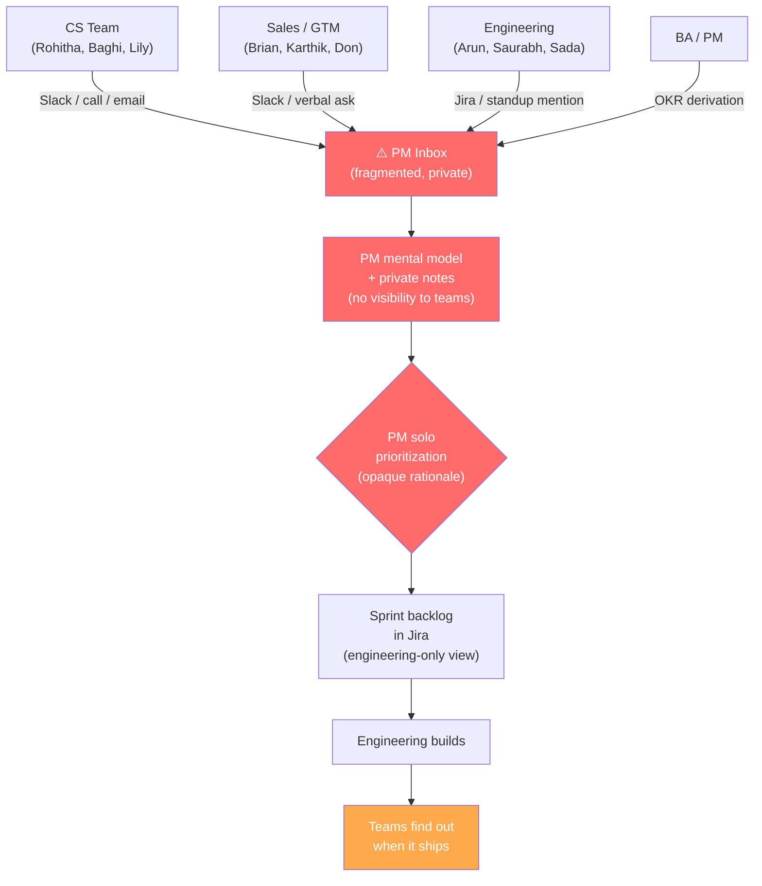
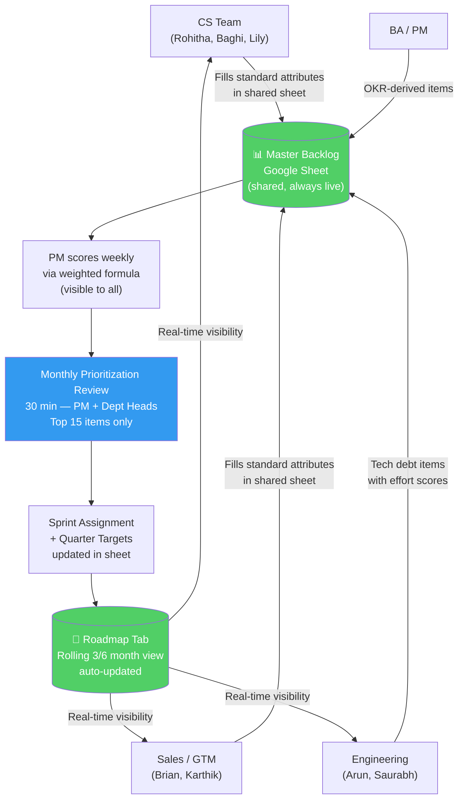

# Process Improvement: Requirement Intake & Prioritization
**For:** Product Leadership, CTO, CEO, Engineering, CS, Sales, BA
**Prepared:** 2026-05-08
**Owner:** PM (Raghav)

---

## The Problem in One Sentence

Requirements from CS (Rohitha, Baghi, Lily), Sales (Brian, Karthik), Engineering (Arun, Saurabh), and BA flow into the PM through disconnected channels with no standard format — making prioritization opaque, roadmap visibility nonexistent for the teams who need it most, and sprint planning reactive instead of strategic.

---

## Current State: What's Breaking

### Pain Points

| # | Pain | Who Feels It | Business Impact |
|---|---|---|---|
| 1 | Requirements arrive via Slack, email, and calls — no single intake channel | PM | Items get lost or forgotten; impossible to audit |
| 2 | No standard format — CS submits anecdotally, Eng submits as Jira tickets, Sales as verbal asks | PM, Engineering | PM spends hours translating before any prioritization work |
| 3 | Zero cross-team visibility — CS doesn't see what Sales submitted, Sales doesn't see what Eng submitted | CS, Sales, Eng | Duplicate submissions, redundant discussions, teams feel unheard |
| 4 | Prioritization is opaque — teams don't know why an item was deprioritized | All teams | Trust erosion; repeated escalations for the same items |
| 5 | Engineering tech debt has no standing next to customer features | Engineering | Tech debt accumulates silently; system stability degrades |
| 6 | No 3/6 month forward view available to CS or Sales | CS, Sales | CS can't set expectations with customers; Sales can't use roadmap in deals |
| 7 | OKR alignment not enforced at requirement level | PM, Leadership | Items ship that don't move OKRs; OKR reviews surprise everyone |
| 8 | Sprint surprises — teams find out what shipped when it ships | All | Customer-facing teams can't prepare; leadership can't plan communications |

---

## Current State Flow



**Key failure points:**
- `B`: Single point of capture failure — PM is the only node
- `C`: No shared state — nothing traceable, nothing auditable
- `D`: No formula, no transparency, no cross-team input to scoring
- `G`: Teams learn at delivery, not at planning — no ability to prepare

---

## Future State: Proposed Process

### Design Principles
1. **One source of truth** — all requirements live in one shared artifact, one view per team
2. **Standard attributes at intake** — each team fills the same columns; PM doesn't translate
3. **Transparent scoring** — priority score is a formula, visible to everyone, PM adjusts with rationale
4. **Forward visibility** — 3/6 month roadmap is a live tab, not a meeting artifact
5. **Engineering parity** — tech debt items scored on same framework as customer features

### Future State Flow



---

## Google Sheets Architecture

### Tab Structure

| Tab | Who Uses It | What It Shows |
|---|---|---|
| **Master Backlog** | PM + All leads | Every requirement, all columns, full score |
| **CS View** | Rohitha, Baghi, Lily | Filtered: Source = CS. Editable: their rows only |
| **Sales View** | Brian, Karthik, Don | Filtered: Source = Sales. Editable: their rows only |
| **Engineering View** | Arun, Saurabh, team | Filtered: Source = Engineering OR Tech Debt = Yes |
| **Roadmap View** | All | Pivot by Quarter + Sprint. Read-only |

### Master Backlog Columns

| Column | Type | Filled By | Notes |
|---|---|---|---|
| Req ID | Auto | System | REQ-001 format |
| Title | Text | Submitting team | Brief, problem-framed |
| Description | Text | Submitting team | 2 sentences: problem + who feels it |
| Source Team | Dropdown | Submitting team | CS / Sales / Engineering / PM / BA |
| Submitted By | Text | Submitting team | Person name |
| Date Submitted | Date | Submitting team | |
| OKR Theme | Dropdown | PM | Revenue Growth / Retention / Platform Stability / New Market |
| Customers Affected (Count) | Number | CS / Sales | Total accounts impacted |
| Customers Who Reported (Count) | Number | CS / Sales | Accounts that explicitly flagged this |
| Affected Account Names | Text | CS / Sales | GeekSpeak, Lassonde, Bush Brothers, etc. |
| Churn Risk Score | 1–5 | CS | 5 = imminent churn risk |
| Health Degradation Risk | 1–5 | CS | 5 = serious health score impact |
| Upsell Opportunity Score | 1–5 | Sales | 5 = major upsell unlock |
| Annual Renewal at Risk | Dropdown | CS / Sales | <$50K / $50K–$200K / $200K–$500K / $500K+ |
| Tech Debt? | Y/N | Engineering | |
| Competitive Gap? | Y/N | Sales / PM | |
| Competitor with This | Text | Sales / PM | Profitero, Stackline, 42Signals, etc. |
| Engineering Effort | Dropdown | Engineering (after review) | XS / S / M / L / XL |
| **PM Priority Score** | Formula | Auto | See formula below |
| Status | Dropdown | PM | New / Under Review / Planned / In Sprint / Done / Deprioritized |
| Target Quarter | Dropdown | PM | Q2 2026 / Q3 2026 / Q4 2026 / Q1 2027 |
| Sprint Assignment | Text | PM | Sprint name/number |
| PM Rationale | Text | PM | Why this rank — required for deprioritized items |

### PM Priority Score Formula

```
Score = (Customers_Affected × 3)
      + (Churn_Risk × 8)
      + (Health_Risk × 6)
      + (Upsell_Score × 4)
      + (OKR_Weight × 7)
      - (Effort_Score × 3)
```

**Scale definitions:**
- All scores: 1–5 (PM fills OKR weight; teams fill rest)
- Effort: XS=1, S=2, M=3, L=4, XL=5
- OKR Weight: Revenue Growth=5, Retention=5, Platform Stability=3, New Market=2

Max theoretical score ≈ 130. Items above 80 → prioritize this quarter. Items 50–80 → next quarter. Items below 50 → parking lot unless strategic exception logged.

---

## Monthly Prioritization Cadence

```
Week 1: Teams fill/update their rows in Master Backlog
Week 2: PM scores all new + updated items (formula runs auto; PM adjusts edge cases)
Week 3: PM prepares Top 15 list for leadership review
Week 4 (30 min): Prioritization Review — PM + Dept Heads
  → Top 10 get sprint assignments or quarter targets
  → Deprioritized items get rationale logged
  → Roadmap tab auto-reflects changes
```

**Who attends Prioritization Review:**
- PM (Raghav) — facilitates, owns output
- Engineering Lead (Arun Kumar T) — effort validation, tech debt advocate
- CS Lead (Rohitha) — customer health advocate
- Sales Lead (Brian/Karthik) — deal impact advocate
- Optional: Product Leader / CEO / CTO for items above $200K renewal risk

---

## What Success Looks Like

| Metric | Current State | Target (2 Quarters) | How Measured |
|---|---|---|---|
| Requirement traceability | ~40% of shipped features traceable to logged req | 95% | Manual audit at sprint retro |
| Prioritization transparency | 0% of deprioritized items have logged rationale | 100% | PM Rationale column — check at month-end |
| Roadmap forecast accuracy | CS/Sales have no forward view | 80% of items in 3-month view ship on time | Sprint retro comparison to roadmap tab |
| Ad-hoc prioritization requests | ~5–8 Slack threads/week to PM | <2/week | PM self-report (weekly retro) |
| Sprint carry-over | Unknown (no tracking) | <20% carry-over | Sprint tracker (already defined) |
| OKR alignment at item level | Not enforced | 100% of items have OKR Theme | OKR Theme column — blank = not allowed in sprint |

---

## What This Does NOT Solve (scope boundary)

- Does not replace engineering sprint ceremonies (standups, retros, sprint planning) — this feeds into them
- Does not define story points or engineering estimates — that stays with Arun's team
- Does not solve DSIM-specific prioritization (separate track, dedicated eng) — separate process
- Does not automate backlog in Jira — Google Sheets is the planning layer; Jira is execution layer

---

## Open Questions for Leadership

1. Who owns the Master Backlog sheet creation and access management? (Suggested: PM, with IT help for permissions)
2. Is monthly cadence right, or should it be bi-weekly given current sprint velocity?
3. Should renewal at risk be in $ ranges or actual ARR from Salesforce? If actual, who pulls it?
4. Do we want a PM Priority Score threshold that auto-flags items for CEO/CTO review?
5. Process #2 (to be discussed next): How does this feed into engineering sprint planning ceremonies?
